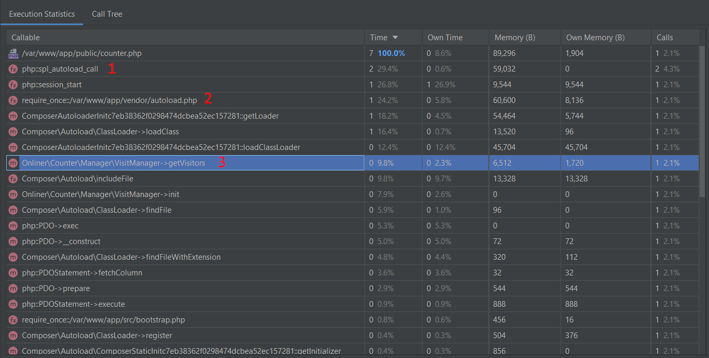

### Onliner test

####  Note:
Created for interview purpose

#### Setup:
1. `make setup`

#### Points of interest:
1. `.docker/nginx/entry.sh` - Html files generator based on `.env` file in the root of directory
2. `app/public/counter.php:14` - return response to the client and then process other part of request, such as counter
3. `app/public/counter.php:17` - see [link](https://github.com/phpredis/phpredis/blob/develop/arrays.markdown#readme). 
4. I decided to use sqlite for storage statistic data per page because it easy to handle, event in distributed filesystems, also sqlite can work with up to 50k write per seconds on a simple data structures (as our is) [19 link](https://www.sqlite.org/faq.html)

#### Other possible approaches:

`Redis` are good for distributed hot storage in my mind it should be there. In other approaches we able to use Time based storages
like `InfluxDB`, but also we will have struggles with update existed rows.

Also `MySQL` or `PgSql` possible here **_(5 years * 365 days * 10000 pages = 18kk rows)_** as we use simple flat data structure it can work without any problems.

As one another way to store time based dataset i thought about `Tarantool` - is in memory computation platform `redis` like but with possibility to write custom business logic.

The final way is dont use `PHP` aswell. We need collect visitors per page and it can be handled by out of the box `Nginx` or `OpenResty` with `Lua` addon that will work in similar to `PHP` way, but with faster implementation inside nginx.

#### PS:

##### AB
233 RPS on 1mem 1cpu docker container under WSL2 (windows subsystem linux) it seems slow, but with proper hardware and software (linux without proxy) configuration result will be better
```
Server Software:        nginx/1.21.1
Server Hostname:        localhost
Server Port:            8081

Document Path:          /counter.php?stat=6
Document Length:        0 bytes

Concurrency Level:      1000
Time taken for tests:   21.378 seconds
Complete requests:      5000
Failed requests:        126
   (Connect: 0, Receive: 0, Length: 126, Exceptions: 0)
Non-2xx responses:      126
Total transferred:      1636967 bytes
HTML transferred:       20442 bytes
Requests per second:    233.89 [#/sec] (mean)
Time per request:       4275.554 [ms] (mean)
Time per request:       4.276 [ms] (mean, across all concurrent requests)
Transfer rate:          74.78 [Kbytes/sec] received

Connection Times (ms)
              min  mean[+/-sd] median   max
Connect:        0    6  12.9      0      58
Processing:     1 2969 4065.3   1754   16120
Waiting:        0 2968 4065.3   1753   16120
Total:          1 2974 4069.3   1754   16130

Percentage of the requests served within a certain time (ms)
  50%   1754
  66%   1773
  75%   1785
  80%   1793
  90%   4842
  95%  15525
  98%  15836
  99%  15984
 100%  16130 (longest request)
```

##### Xdebug



_See numbers on image:_

1-2: we able to disable composer autoload and keep simple PHP files and inject them one by one thorough `require_once` to speedup application for 24%

3: This method used to show counter of visitors on the page, we can remove it to increase performance of our application for 10% 
